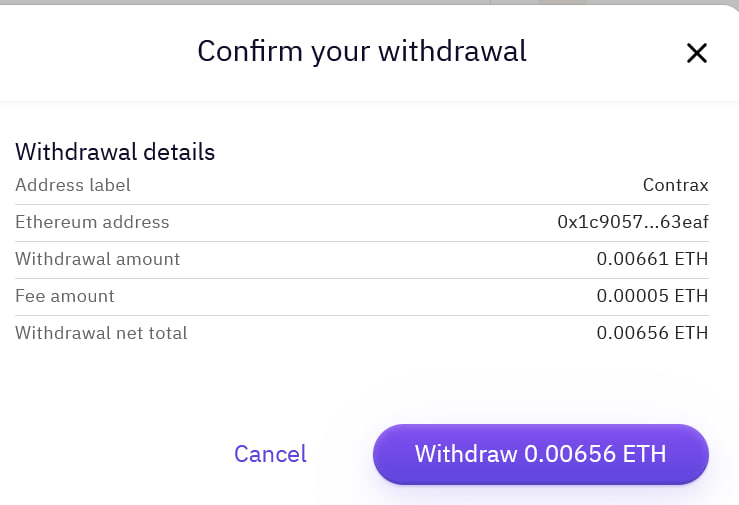

## Create your Contrax Wallet

Before transferring, you need a wallet on Contrax to recieve your ETH.

Follow the quick guide on [creating a Contrax wallet](../start/wallet-setup), unless you already have a preferred Web3 wallet extention like MetaMask. If so, you can connect it via "Connect Wallet." Try "Wallet Connect" if you do not see it.

## Transfer from Kraken to Contrax

<Frame></Frame>
<Frame></Frame>
<Frame></Frame>
<Frame></Frame>
<Frame></Frame>
